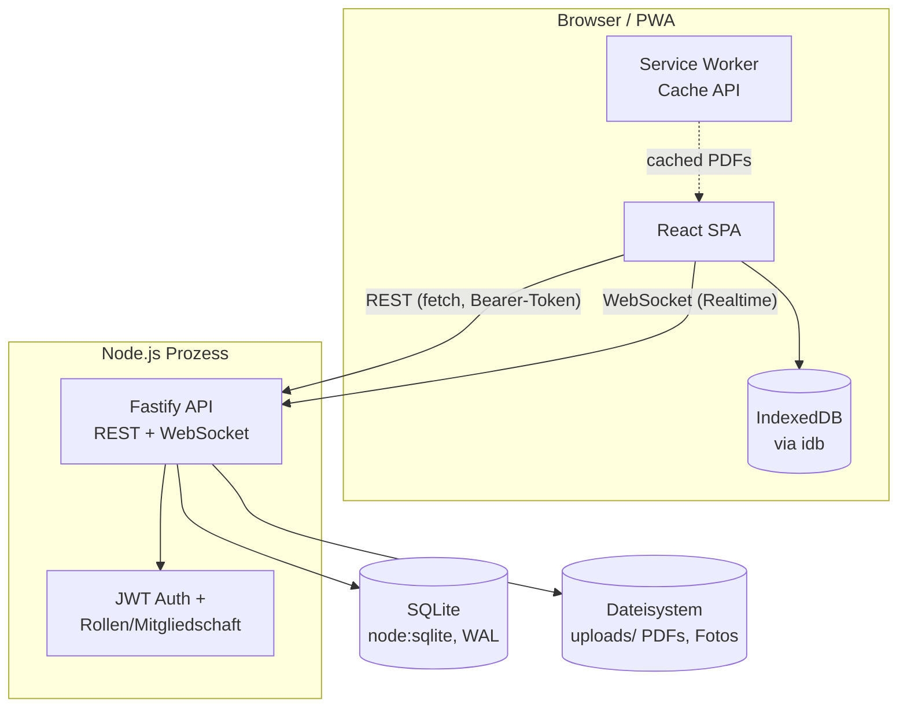
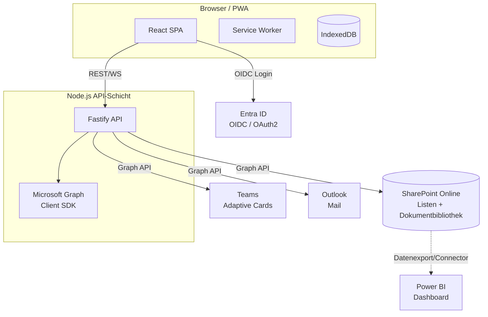

# Architektur- und Spezifikationsdokument: PlanRadar-Ersatz

**Status:** POC-Woche (WP14–WP20) abgeschlossen und lauffähig. Dieses Dokument fasst die Architekturentscheidung, das Datenmodell, die API, die Screens, das Sicherheitskonzept, die Teststrategie und den MVP-Plan zusammen — sowohl für das, was heute läuft, als auch für das Zielbild einer vollständigen M365-Integration.

## A. Architekturentscheidung

### Empfehlung: React/Vite-PWA + Node.js/Fastify-API (bestehender Stack), SharePoint/Graph als dokumentiertes Zielbild

**Begründung:**

1. **Wiederverwendung statt Neubau.** Die POI-App (WP1–WP13) existierte bereits als funktionierende Basis: PDF-Rendering, Pin-Platzierung, Multiuser mit WebSocket-Realtime, Offline-Sync über IndexedDB mit funktionierender Konflikterkennung. Diese Investition auf NestJS/.NET umzustellen, hätte in der verfügbaren Zeit (1 Woche, ~1h aktive Zeit/Tag) ausschließlich Migrationsaufwand ohne fachlichen Mehrwert bedeutet.
2. **Kein M365-Tenant vorhanden.** Echte SharePoint-Listen, Microsoft Graph, Entra-ID-App-Registrierung oder Teams-Adaptive-Cards können ohne Tenant-Zugang nicht gebaut UND verifiziert werden. Code, der gegen eine nicht vorhandene Umgebung geschrieben wird, ist ungetestete Behauptung, kein funktionierender POC. Die Fastify+SQLite-Kombination ist dagegen vollständig lokal lauffähig und wurde bei jedem Arbeitspaket per curl- und Browser-Test verifiziert.
3. **Node.js als einheitliche Sprache** über Frontend (React/TS) und Backend (Fastify/TS) reduziert Kontextwechsel und Onboarding-Aufwand gegenüber NestJS (mehr Framework-Overhead ohne klaren Mehrwert für diese Größenordnung) oder .NET (zweite Sprache/Toolchain im Team).
4. **`node:sqlite` statt `better-sqlite3`:** Auf der Windows-ARM64-Entwicklungsmaschine besteht ein reales Risiko fehlender vorkompilierter nativer Bindings. Das eingebaute `node:sqlite`-Modul (Node ≥ 22.5) bietet dieselbe synchrone API ohne dieses Risiko — eine layer-interne Entscheidung ohne Auswirkung auf die Architektur nach außen.

**Zielbild (nicht Teil dieser Woche, siehe Abschnitt I):** Migration der Datenhaltung auf SharePoint-Listen/Dataverse via Microsoft Graph, Authentifizierung über Entra ID/OIDC statt eigenem JWT, Benachrichtigungen über Graph (Teams Adaptive Cards, Outlook Mail). Die aktuelle Architektur ist so geschnitten (Repository-Layer pro Entität, generischer `authorization.ts`-Baustein, entkoppelter Offline-Sync-Layer), dass dieser Umbau inkrementell und ohne Neuentwurf der Fachlogik möglich ist.

### Alternative kurz gewürdigt: Power Apps / Power Automate (Low-Code)

Eine reine Power-Apps-Variante (Canvas-App auf SharePoint-Listen/Dataverse, Power Automate für Benachrichtigungen) wäre für Standard-Formulare und einfache Genehmigungsflows attraktiv und würde nativ in M365 integrieren. Für die hier geforderten Kernanforderungen ist sie jedoch nicht die bessere Wahl:

- **PDF-Rendering mit Pin-Overlay auf exakten Koordinaten** ist in Power Apps nur mit erheblichem Custom-Component-Aufwand (PCF Components, eigenes JS) realisierbar — im Kern dieselbe Individualentwicklung wie jetzt, nur in einem restriktiveren Rahmen.
- **Offline-Fähigkeit mit Konfliktlösung** (FA-602/FA-603-Anforderungen) ist in Power Apps deutlich eingeschränkter als eine selbst kontrollierte IndexedDB-Sync-Pipeline.
- Die bereits funktionierende Codebasis würde verworfen.

Power Apps bleibt eine sinnvolle Option für **Randprozesse** (z. B. ein einfaches Freigabe-Formular für Subunternehmer-Zugänge), aber nicht als Ersatz für den Kern der Anwendung.

---

## B. Komponenten-/Containerdiagramm

### Ist-Zustand (diese Woche)



### Zielbild (nach M365-Integration)



---

## C. Datenmodell

### TypeScript-Interfaces (aus `packages/shared/src/types.ts`, produktiv im Einsatz)

```typescript
interface Project {
  id: string; name: string; description: string | null;
  created_by: string | null; created_at: string; archived: number;
  project_number: string | null; address: string | null; customer: string | null;
  status: string; project_lead: string | null;
}

interface Plan {
  id: string; project_id: string; name: string;
  file_path: string | null; file_hash: string | null; page_count: number | null;
  bauabschnitt: string | null; uploaded_by: string | null; uploaded_at: string;
}

interface Point /* = "Ticket" */ {
  id: string; plan_id: string; page_number: number; x: number; y: number;
  point_type: string; category_id: string | null; custom_fields: string | null;
  status: string; title: string; description: string | null; bauabschnitt: string | null;
  priority: string | null; assigned_to: string | null; due_date: string | null;
  gewerk: string | null; raum_bereich: string | null;
  created_by: string | null; created_at: string; updated_by: string | null; updated_at: string;
  version: number; deleted: number;
}

interface Category {
  id: string; project_id: string | null; name: string; color: string; glyph: string;
  field_schema_json: string; created_by: string | null; created_at: string; archived: number;
}

interface Attachment {
  id: string; point_id: string; file_path: string; file_name: string;
  mime_type: string; size_bytes: number; uploaded_by: string | null; uploaded_at: string;
}

interface PointComment {
  id: string; point_id: string; author_id: string | null; body: string; created_at: string;
}

interface PointHistoryEntry {
  id: string; point_id: string; changed_by: string | null; changed_at: string;
  field_changed: string; old_value: string | null; new_value: string | null; source: string;
}
```

`CategoryFieldSchema` (`packages/shared/src/categoryFieldSchema.ts`):

```typescript
type FieldType = 'text' | 'multiline' | 'number' | 'date' | 'boolean' | 'choice'
               | 'multi-choice' | 'person' | 'image' | 'file' | 'signature'; // letzte 5 reserviert, kein Renderer im POC
interface FieldDef { key: string; label: string; type: FieldType; required?: boolean; options?: string[] }
interface CategoryFieldSchema { version: 1; fields: FieldDef[] }
```

### SQL-Schema (SQLite, 14 Migrationen, aktueller Stand)

| Tabelle | Zweck |
|---|---|
| `users` | Nutzer, Rolle (viewer/inspector/project_admin/tenant_admin), bcrypt-Passwort-Hash |
| `projects` | Projekte inkl. Stammdaten (Nummer, Adresse, Kunde, Status, Projektleitung) |
| `project_members` | Projekt-Zugriffskontrolle (M:N Nutzer↔Projekt) |
| `plans` | PDF-Baupläne je Projekt |
| `categories` | Ticket-Kategorien mit `field_schema_json` (global oder projektspezifisch) |
| `points` | Tickets: Position, Kategorie, Custom-Fields (JSON), Status, Zuweisung, Termine |
| `point_attachments` | Fotos/Dokumente je Ticket |
| `point_comments` | Freitext-Kommentare je Ticket |
| `point_status_history` | Feldweise Änderungshistorie (Audit-Trail) |
| `change_log` | Sync-Cursor-Tabelle (Sequenz je Projekt) für Offline-Sync |
| `notifications` | Benachrichtigungs-Stub (siehe Abschnitt D, `/notifications`) |

### Zukünftige SharePoint-Listen-Zuordnung (nur beschrieben, nicht gebaut)

| SQLite-Tabelle | SharePoint-Äquivalent |
|---|---|
| `projects` | SharePoint-Liste "Projekte" (oder Dataverse-Tabelle bei komplexerer Beziehungslogik) |
| `plans` | Dokumentbibliothek "Baupläne" + Metadaten-Spalten |
| `points` | SharePoint-Liste "Tickets" — `custom_fields` würde bei echten SharePoint-Listen idealerweise auf tatsächliche dynamische Spalten abgebildet, was Column-Provisioning via Graph API bei Kategorie-Anlage erfordert (State heute: JSON-Blob, siehe Scope-Cut in Abschnitt I) |
| `point_attachments` | Native SharePoint-Listen-Anhänge oder Dokumentbibliothek mit Verknüpfung |
| `point_comments` | SharePoint-Listen-Kommentarfunktion oder eigene Liste |
| `change_log` | Entfällt — SharePoint/Graph bietet `delta`-Queries für Change-Tracking nativ |

---

## D. REST-API-Spezifikation

Alle Endpunkte (außer `/api/auth/login`) erfordern `Authorization: Bearer <JWT>`. Projektbezogene Endpunkte prüfen zusätzlich Projekt-Mitgliedschaft (`tenant_admin` hat globalen Zugriff).

### `/projects`
| Methode | Pfad | Beschreibung |
|---|---|---|
| POST | `/api/projects` | Projekt anlegen (Rolle `project_admin`/`tenant_admin`) |
| GET | `/api/projects` | Liste (gefiltert nach Mitgliedschaft, außer `tenant_admin`) |
| GET | `/api/projects/:id` | Einzelnes Projekt |
| GET/POST | `/api/projects/:id/members` | Mitgliederliste / Mitglied hinzufügen |
| DELETE | `/api/projects/:id/members/:userId` | Mitglied entfernen |
| GET | `/api/users` | Nutzerliste (für Zuweisungs-/Mitglieder-Picker) |

### `/drawings` (im Code: `/plans`)
| Methode | Pfad | Beschreibung |
|---|---|---|
| POST | `/api/projects/:id/plans` | PDF-Upload (multipart) |
| GET | `/api/projects/:id/plans` | Pläne eines Projekts |
| GET | `/api/plans/:id/file` | PDF-Datei-Stream |

### `/rendered-pages` (Zielbild, nicht gebaut)
Serverseitiges PDF→PNG/WebP-Rendering wurde bewusst nicht implementiert (Risiko nativer Bindings wie `node-canvas` auf dieser Maschine). Client-seitiges `pdf.js`-Rendering ist produktiv im Einsatz. Zielendpunkt wäre `GET /api/plans/:id/pages/:pageNumber.png`.

### `/categories`
| Methode | Pfad | Beschreibung |
|---|---|---|
| GET | `/api/projects/:id/categories` | Globale + projektspezifische Kategorien |
| POST | `/api/projects/:id/categories` | Kategorie mit Feld-Schema anlegen (Rolle `project_admin`+) |

### `/tickets` (im Code: `/points`)
| Methode | Pfad | Beschreibung |
|---|---|---|
| GET | `/api/points?planId=&status=&assignedTo=&bauabschnitt=&from=&to=` | Gefilterte Liste |
| POST | `/api/points` | Ticket anlegen (Rolle `inspector`+) |
| PUT | `/api/points/:id` | Ticket ändern (Optimistic Concurrency via `version`) |
| DELETE | `/api/points/:id` | Soft-Delete |
| GET | `/api/points/:id/history` | Feldweise Änderungshistorie |
| GET/POST | `/api/points/:id/comments` | Kommentare lesen/hinzufügen |

### `/attachments`
| Methode | Pfad | Beschreibung |
|---|---|---|
| POST | `/api/points/:id/attachments` | Foto/PDF hochladen (MIME-Whitelist) |
| GET | `/api/points/:id/attachments` | Liste je Ticket |
| GET | `/api/attachments/:id/file` | Datei-Stream |

### `/comments`
Siehe `/tickets` oben — Kommentare sind ticket-scoped, kein eigener Top-Level-Endpunkt nötig.

### `/reports`
| Methode | Pfad | Beschreibung |
|---|---|---|
| GET | `/api/projects/:id/points/export.csv?planId=&status=&...` | CSV-Export der gefilterten Ticketliste (UTF-8 BOM, Excel-kompatibel) |

PDF-Mängelbericht (Plan-Ausschnitt + Pins + Fotos + Verlauf) und Power-BI-Dashboard sind nicht Teil dieser Woche (siehe Abschnitt I).

### `/sync`
| Methode | Pfad | Beschreibung |
|---|---|---|
| GET | `/api/projects/:id/offline-bundle` | Voller Snapshot für Offline-Start |
| GET | `/api/sync/:projectId/changes?since=` | Delta-Pull seit Cursor |
| POST | `/api/sync/:projectId/push` | Batch-Push lokaler Änderungen, Konflikterkennung |

### `/notifications`
| Methode | Pfad | Beschreibung |
|---|---|---|
| — | — | Nur interner Schreib-Hook (`pointRepository.updatePoint` bei `assigned_to`-Änderung) in `notifications`-Tabelle. Bewusst **kein** GET-Endpunkt/UI in dieser Woche — Demo-Wert ohne echten Empfängerkanal (Teams/Mail) gering. Zielbild: Graph-Adapter, der bei Schreibvorgang eine Adaptive Card an Teams sendet bzw. eine Outlook-Mail auslöst. |

### `/ws` (nicht im Lastenheft-Katalog, aber zentral für FA-403)
`GET /ws/plans/:planId?token=` — WebSocket, broadcastet `point.created`/`point.updated`/`point.deleted` an alle Mitglieder desselben Plans (Projekt-Mitgliedschaft wird beim Verbindungsaufbau geprüft).

---

## E. Frontend-Screens

| Screen (Lastenheft) | Status | Anmerkung |
|---|---|---|
| Login | ✅ gebaut | `LoginForm.tsx`, E-Mail/Passwort gegen JWT-Login |
| Projektliste | ✅ gebaut | Teil von `App.tsx` — Liste + Anlage-Formular mit Stammdaten |
| Projekt-Dashboard | ✅ gebaut (vereinfacht) | Mitglieder- und Kategorien-Sektion je Projekt |
| Planviewer mit Pins | ✅ gebaut | `PdfViewer.tsx` — Klick-Pinning, kategorie-getriebene Farbe/Glyph, kein Multi-Page/Zoom |
| Ticket-Detail | ✅ gebaut | Eingebettet im Punkt-Formular: Felder, Historie/Kommentare (`PointTimeline.tsx`), Fotos (`AttachmentGallery.tsx`) |
| Ticket-Formular dynamisch | ✅ gebaut | `DynamicFieldForm.tsx` — text/multiline/date/choice/number/boolean; multi-choice/person/image/file/signature nur als Platzhalter |
| Fotoupload/Kamera | ✅ gebaut | `capture="environment"` für Mobil-Kameraaufnahme direkt aus der Galerie |
| Ticketliste/Kanban | ⚠️ teilweise | `TicketList.tsx` als sortierbare Tabelle mit Filtern; Kanban-Board nicht gebaut |
| Reports | ⚠️ teilweise | CSV-Export-Button; PDF-Mängelbericht nicht gebaut |
| Sync-Status | ⚠️ teilweise | Online/Offline-Indikator, Pending-Count, "Jetzt synchronisieren"-Button im Header; kein eigener Screen |
| Admin: Kategorien | ✅ gebaut | `CategoryAdmin.tsx` |
| Admin: Feldschemas | ✅ gebaut | Teil von `CategoryAdmin.tsx` (Feld-Repeater) |
| Admin: Rollen | ⚠️ teilweise | Rollenvergabe nur serverseitig via `seedAdmin.ts`-Skript, keine UI |
| Admin: Berichtsvorlagen | ❌ nicht gebaut | Kein Vorlagenkonzept, da kein PDF-Report gebaut wurde |

**Architektur-Hinweis:** Es gibt aktuell **keinen Router** — alle Screens sind bedingt gerenderte Abschnitte einer einzigen `App.tsx` (WP21, optional/Stretch, würde das aufsplitten).

---

## G. Sicherheitskonzept

### Authentifizierung (heute)
- `@fastify/jwt`, Login gegen `users`-Tabelle (bcrypt-Hash, Cost 10), Token-Payload `{sub, email, role}`, Ablauf 12h.
- Kein Self-Signup — Nutzer werden ausschließlich über `scripts/seedAdmin.ts` angelegt (geschlossenes System, passend für ein internes Tool).

### Authentifizierung (Zielbild)
- Entra-ID/OIDC-Login via `@azure/msal-node` oder `openid-client`, Rollenzuordnung über Entra-ID-App-Rollen oder Gruppenzugehörigkeit statt eigener `role`-Spalte.
- Externe Projektbeteiligte/Subunternehmer: Entra-ID-B2B-Gastzugänge, gemappt auf die bestehende `project_members`-Tabelle (Konzept bleibt identisch — nur die Identitätsquelle wechselt).

### Autorisierung (heute, produktiv)
- **Rollen** (`packages/backend/src/authorization.ts`): `viewer < inspector < project_admin < tenant_admin` — **eine globale Rolle pro Nutzer** (bewusste POC-Vereinfachung, keine pro-Projekt-Rollen).
- **Projekt-Zugriff**: `project_members`-Tabelle, geprüft via `requireProjectAccess()` in jeder projektbezogenen Route (REST) und beim WebSocket-Verbindungsaufbau. `tenant_admin` umgeht die Mitgliedschaftsprüfung.
- **Schreibrechte**: `requireRole(['inspector','project_admin','tenant_admin'])` für alle mutierenden Ticket-/Plan-/Kategorie-Routen — Viewer sind rein lesend.
- Durchgängig getestet: siehe Abschnitt H, WP14-Verifikationsmatrix (3 Rollen × Mitgliedschaft × mehrere Routen).

### Audit-Log
- `point_status_history`: feldweise Änderungshistorie (wer, wann, alter/neuer Wert, Quelle online/offline-sync) — deckt die Kern-Nachweispflicht für sicherheitsrelevante Vorgänge auf Ticket-Ebene ab.
- Kein globales, tabellenübergreifendes Audit-Log (z. B. für Projekt-Anlage, Mitglieder-Änderungen) — Zielbild-Erweiterung, aktuell aus Zeitgründen nicht gebaut.

### Mandanten-/Projekttrennung
- Datenbankseitig durch `project_members` + Rollenprüfung realisiert, kein physisch getrennter Mandant (single SQLite-Datei für alle Projekte) — für eine interne Werkzeuglösung mit einem Tenant ausreichend; bei Mehrmandantenfähigkeit (mehrere Firmen) wäre eine zusätzliche `tenant_id`-Spalte oder DB-pro-Mandant nötig.

---

## H. Teststrategie

### Angewandte Methodik dieser Woche (jedes WP einzeln verifiziert vor dem nächsten)
1. **API-/Integrationstests via curl**: Für jede neue Route eine konkrete curl-Sequenz (Login → Aktion → Zustandsprüfung), inkl. Negativfällen (403 bei fehlender Rolle/Mitgliedschaft, 400 bei ungültigem MIME-Typ, JSON-Roundtrip bei Custom-Fields).
2. **Browser-/E2E-Tests via Playwright** (temporär installiert, nach jedem WP wieder entfernt): vollständiger Nutzerfluss (Login → Projekt anlegen → Plan hochladen → Ticket erstellen/bearbeiten → Aktion verifizieren), inkl. Screenshot-Beweis und Konsolenfehler-Prüfung.
3. **Build-Verifikation**: `tsc`-Kompilierung (Backend + Frontend) nach jeder Änderung — TypeScript deckt strukturelle Fehler ab, die im schnellen `tsx watch`-Dev-Modus (kein Type-Checking) unbemerkt blieben.

### Bestehende Lasttest-Infrastruktur (aus WP2/WP9, wiederverwendbar für 5000-Ticket-Performanceziel)
- `packages/backend/src/scripts/loadtest.ts` und `loadtestPoints.ts`: parametrisierbare parallele Schreiblast-Simulation gegen die API (Concurrency, Gesamtanzahl konfigurierbar). Baseline aus WP2: ~1830 writes/sec bei Concurrency 20 auf `node:sqlite`.
- Für den 5000-Ticket-Performancetest (NFR aus dem Lastenheft): `loadtestPoints.ts` mit `TOTAL=5000` gegen ein Testprojekt ausführen, anschließend `GET /api/points?planId=` mit Filtern timen. SQLite mit Index auf `plan_id`/`updated_at`/`status`/`assigned_to` sollte das ohne Weiteres bewältigen; falls nicht, ist das der Trigger für den dokumentierten PostgreSQL-Wechsel (siehe ursprünglicher WP2-Plan-Kontext).

### Unit-Tests
- Aktuell **kein** Unit-Test-Framework eingerichtet (kein `vitest`/`jest` in `package.json`). Für den POC-Zeitrahmen wurde API-/E2E-Verifikation als höherwertiger Nachweis priorisiert (deckt Integration zwischen Schichten ab, die Unit-Tests allein nicht zeigen). Empfehlung für die Zukunft: `vitest` für Repository-Funktionen (reine SQL-Logik, leicht isolierbar) ergänzen.

### Offline-/Sync-Tests
- Manuell verifiziert in WP12/WP13 (vor dieser Dokumentationswoche): Flugmodus-Test über Chrome-DevTools-Netzwerksimulation, Konfliktszenario mit zwei parallelen Änderungen am selben Ticket.
- Für zukünftige automatisierte Abdeckung: Playwright unterstützt `context.setOffline(true)` — die manuellen DevTools-Schritte lassen sich 1:1 in ein Playwright-Skript überführen.

### Performance-Test mit 5000 Tickets/Projekt (NFR)
Noch nicht ausgeführt (Zeitbudget-Priorität lag auf funktionaler Breite). Nächster konkreter Schritt: `loadtestPoints.ts` erweitern um Szenario "5000 Punkte in einem Projekt, dann `GET /api/points` mit realistischen Filterkombinationen timen".

---

## I. MVP-Plan (Neurahmung der Lastenheft-Struktur MVP1–4 an die tatsächliche Umsetzung)

| Stufe | Inhalt | Status |
|---|---|---|
| **MVP1** | Projekte, PDF-Pläne, PDF-Rendering (clientseitig), Planviewer mit Pins, Punkte/Tickets-CRUD, JWT-Auth, Multiuser-Realtime (WebSocket), Konflikterkennung, funktionierendes Offline-Sync (IndexedDB) | ✅ Fertig (WP1–WP13, vor dieser Woche) |
| **MVP1.5 (diese POC-Woche)** | Rollen & Projekt-Mitgliedschaft, dynamische Ticket-Kategorien mit Feld-Schema, erweiterte Ticketfelder & Status-Workflow, Ticket-Liste, Fotos/Anlagen, Historie & Kommentare, CSV-Export, Notification-Stub | ✅ Fertig (WP14–WP20) |
| **MVP2** | Echte Microsoft-Graph-Integration (SharePoint als Datenhaltung, Entra-ID-Login, Teams/Outlook-Benachrichtigungen mit Adaptive Cards), PDF-Mängelbericht-Generator, Power-BI-Anbindung, externe Nutzer/Gastzugänge | ⏳ Nicht begonnen — benötigt M365-Tenant |
| **MVP3** | Serverseitiges PDF-Rendering mit Planversionierung, Kanban-Board, vollwertige Admin-UI (Rollen, Berichtsvorlagen), Router/Screen-Aufteilung (WP21), Offline-Sync für Fotos, mehrere Bauplan-Seiten | ⏳ Nicht begonnen |
| **MVP4** | BIM/IFC-Verknüpfung (ElementId/IFC-GUID auf Tickets), Autodesk-Construction-Cloud-Integration, ERP-Anbindung (SAP/Navision via REST), CSV/Excel-Import, KI-gestützte Mängelklassifikation | ⏳ Nicht begonnen — reine Zukunftsvision, kein konkreter Zeitplan |

### Bewusste Scope-Cuts dieser Woche (dokumentiert, damit später nichts überrascht)
- **Eine globale Rolle pro Nutzer** statt pro-Projekt-Rollen — spart erheblichen Autorisierungs-Komplexitätsaufwand, bei Bedarf später erweiterbar (`project_members` könnte um eine `role`-Spalte ergänzt werden).
- **`custom_fields` als JSON-Blob** ohne serverseitige Filterung/Suche — für SharePoint-Migration relevant (dort eher echte Spalten pro Feld).
- **Fotos sind online-only**, nicht Teil der Offline-Sync-Pipeline — Erweiterung würde Blob-Handling in IndexedDB + Pending-Queue-Generalisierung erfordern.
- **Kein serverseitiges PDF-Rendering** — Risiko nativer Bindings auf dieser Entwicklungsmaschine, clientseitiges `pdf.js` deckt den funktionalen Bedarf für den POC vollständig ab.
- **Notifications ohne Empfängerkanal** — Tabelle + Schreib-Hook vorhanden, aber ohne Teams/Mail-Anbindung faktisch nur ein Logbuch; echter Wert entsteht erst mit Graph-Integration (MVP2).
